# TIA Portal Automotive Assembly Station — MES-Integrated PLC Control (v1: PLC Logic)

**Status:** v1 — PLC control logic complete. HMI (v2) and OPC UA / historian / analytics integration (v3) are in active development — see [Roadmap](#roadmap).

## Overview

This project simulates a bumper sub-assembly station on a Siemens S7-1500 PLC, built in TIA Portal V19. The station verifies the incoming bumper's sequence reference, then runs a strict four-stage fitting process (fog lamp verification → fog lamp tightening → rear camera verification → rear camera tightening) before releasing the part. Every recipe value the station uses — torque targets, required fastening steps, expected part codes, expected sequence reference — is requested from a simulated MES interface block rather than hardcoded, mirroring how a real production station depends on MES for correct operation.

The project is a portfolio piece translating hands-on MES/production-floor experience (see [Background](#background)) into a Siemens/German-ecosystem toolchain, aimed at PLC, MES, and IT-OT/Digital Shopfloor roles.

## Demo

🎥 [Watch the working demo](#) *(link to be added)*

The demo shows a full cycle end-to-end in PLCSIM: sequence acceptance, both verify/tighten stages, a duplicate-scan rejection, and a fault → manual override → recovery sequence, narrated live.

## Architecture

```
┌──────────────────────┐        ┌───────────────────────┐
│  FB_StationController│◄──────►│   FB_MES_Interface    │
│  (state machine,     │        │  (simulated MES:      │
│   process logic)     │        │   recipe, sequence,   │
│                      │        │   part-presence data) │
└─────────┬────────────┘        └───────────────────────┘
          │
          ▼
     Main [OB1]
          │
          ▼
  ┌───────────────┐      (v2)      ┌──────────────┐
  │  WinCC HMI    │ ─────────────► │  Operator UI │
  └───────────────┘                └──────────────┘
          │
          ▼ (v3)
  OPC UA → Python (asyncua) → PostgreSQL → Power BI
```

- **PLC:** S7-1500 CPU 1511-1 PN, simulated (PLCSIM)
- **Engineering:** TIA Portal V19
- **Control logic:** `FB_StationController_1` — full station state machine
- **MES simulation:** `FB_MES_Interface` — simulated recipe/sequence delivery with realistic request/response delay
- **Wiring:** `Main [OB1]` — calls both FBs, routes MES outputs into station controller inputs

## Process Flow

```
WAIT_PART → WAIT_BARCODE → VERIFY_SEQUENCE
        │
        ▼ (only the next expected sequence number is accepted — any other value rejects)
REQUEST_RECIPE → WAIT_RECIPE → RECIPE_READY
        │
        ▼
[Stage 1] Fog Lamp Part Verification   — expected part code vs. scanned barcode
        │
        ▼
[Stage 2] Fog Lamp Tightening          — 2-step fastening, torque OK/NOK per step
        │
        ▼
[Stage 3] Rear Camera Part Verification — expected part code vs. scanned barcode
        │
        ▼
[Stage 4] Rear Camera Tightening       — 2-step fastening, torque OK/NOK per step
        │
        ▼
PROCESS_COMPLETE → RELEASE_PART → WAIT_PART (next bumper)
```

Any stage can fault out to a dedicated `FAULT` state with its own alarm code (see below); faults are recoverable via `Reset` (full restart) or `ManualOverrideAuth` (see [Fault Handling & Override Behavior](#fault-handling--override-behavior)).

## Screenshots

Ladder logic networks, in process order:

**Network 1 — Emergency Stop & Safety Reset**
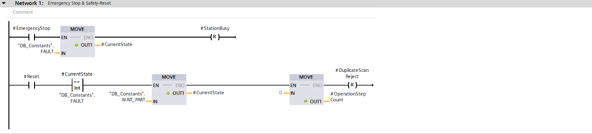

**Network 2 — Barcode Scan**
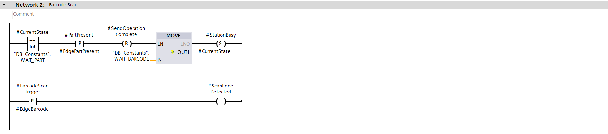

**Network 3 — Duplicate Scan Check**
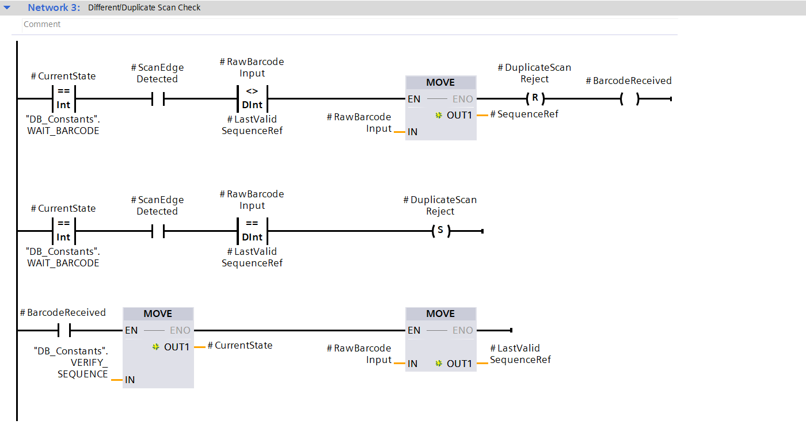

**Network 4 — Expected Value (MES) vs. Scanned Value Check**
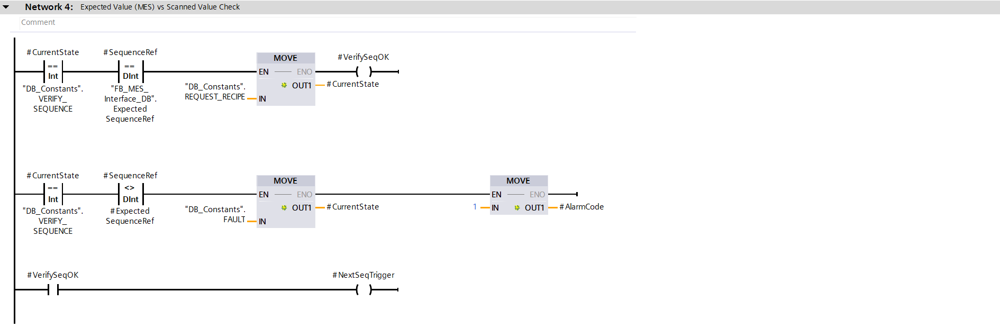

**Network 5 — Request Recipe to MES**
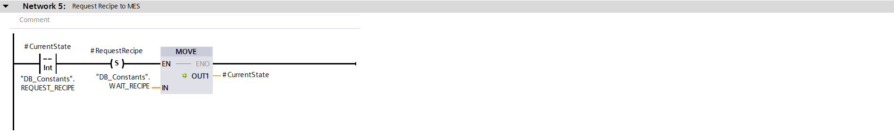

**Network 6 — Receive Recipe from MES**
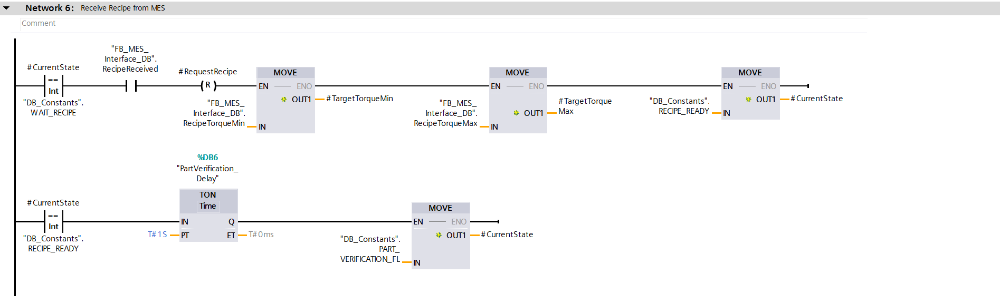

**Network 7 — Edge-Memory Bit for P_TRIG on TorqueOK**
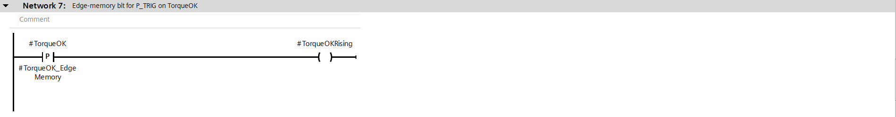

**Network 8 (1) — Fog Lamp Part Verification & Tightening, Process Running**
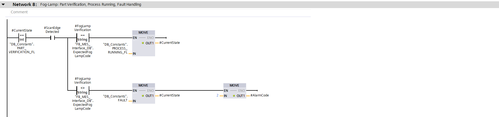

**Network 8 (2) — Fog Lamp Part Verification & Tightening, Process Running**
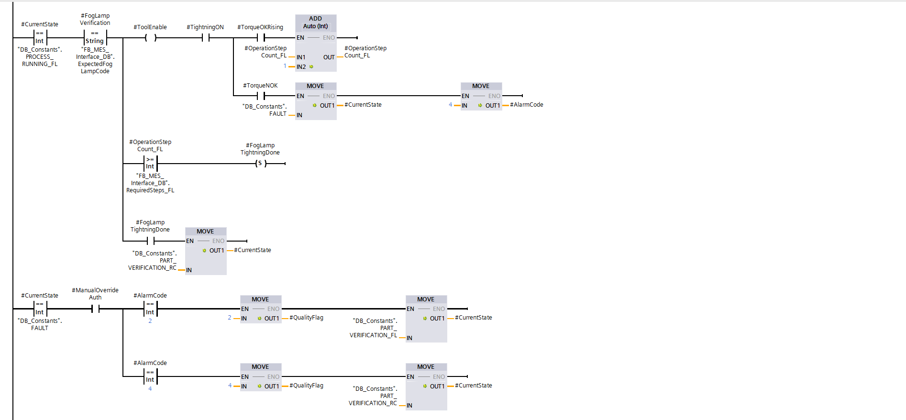

**Network 9 (1) — Rear Camera Part Verification & Tightening, Process Running**
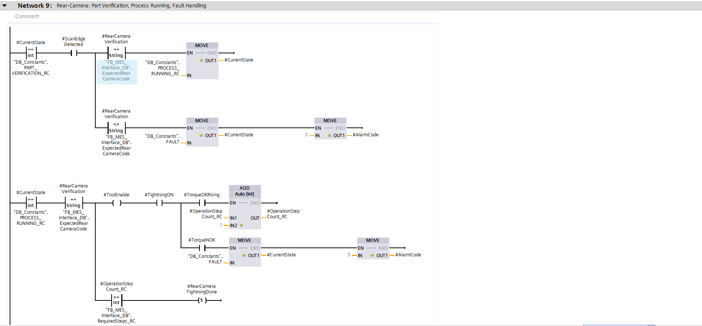

**Network 9 (2) — Rear Camera Part Verification & Tightening, Process Running**
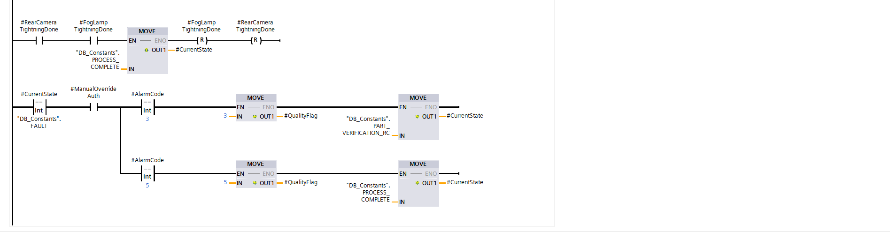

**Network 10 — Release Part & Conveyor**
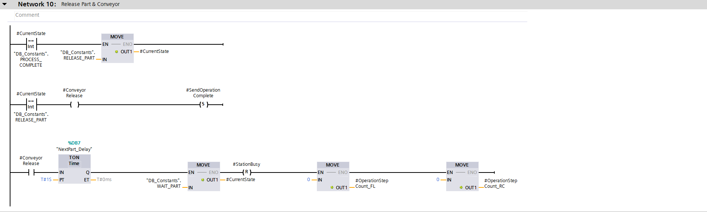

**Network 11 — Current State Lamp Output**
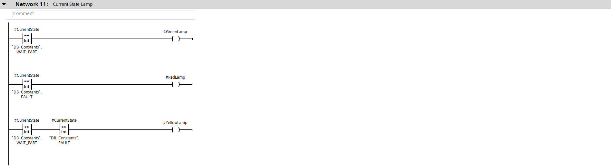

## FB_MES_Interface — Simulated MES Networks

The MES interface block simulates recipe delivery with a realistic request/response delay, rather than responding instantly:

**Network 1 — Preparation for the Next Sequence**
`ExpectedSequenceRef` is a plain incrementing number — no string prefix or formatting — kept as a bare `DInt` and incremented directly via `ADD`, triggered by `NextSeqTrigger` once the prior request/response cycle completes.
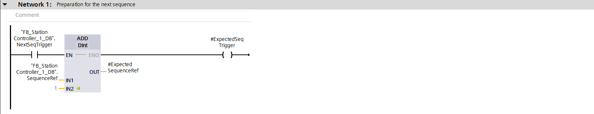

**Network 2 — Recipe Request Received**
Edge-detects the station's `RequestRecipe` signal and sets `RecipeRequestPending`, resetting `RecipeReceived` for the new cycle.
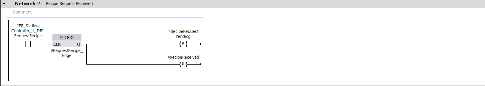

**Network 3 — Recipe Delay**
An `800ms` `TON` timer simulates a realistic MES response delay rather than an instantaneous reply.
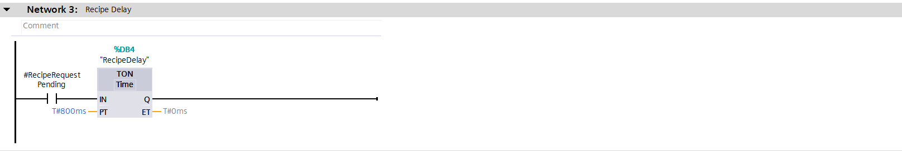

**Network 4 — Sending the Recipe**
On timer completion, delivers torque min/max and required-step counts for both fog lamp and rear camera stages, then sets `RecipeReceived` and clears `RecipeRequestPending`.
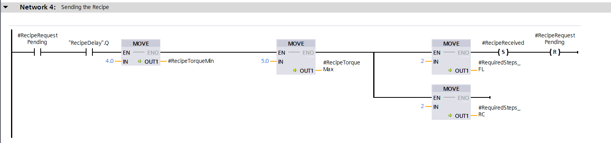

## Signature Elements

1. **Sequence gating** — the station only accepts the *next expected* sequence reference for the incoming bumper; any other value is rejected as a duplicate/out-of-order scan. The expected value is generated and incremented inside `FB_MES_Interface` (via `NextSeqTrigger`, fired once a request/response cycle completes) so each accepted part immediately arms the correct expected value for the next one.
2. **Sequential 4-stage verify/tighten process** — fog lamp and rear camera are handled as two independent, ordered stages, each with its own part-verification check and its own 2-step torque-gated tightening sequence, rather than a single flat pass/fail gate.
3. **MES-driven recipe values throughout** — torque targets, required fastening steps, and expected part codes are always requested from `FB_MES_Interface`, never hardcoded on the station side, even where a value happens to be constant across variants. This is a deliberate design choice to demonstrate MES dependency, not local assumption.
4. **Per-fault alarm codes with differentiated override behavior** — each fault type (sequence mismatch, fog lamp verify fail, fog lamp torque NOK, rear camera verify fail, rear camera torque NOK) has its own alarm code, and manual override behaves differently depending on *what kind* of fault is being overridden (see below).

## Fault Handling & Override Behavior

| Alarm Code | Fault | Override Behavior |
|---|---|---|
| 1 | Sequence mismatch | Recoverable via `Reset` only |
| 2 | Fog lamp part verification fail | Override retries fog lamp verification (part needs re-checking) |
| 3 | Rear camera part verification fail | Override retries rear camera verification (part needs re-checking) |
| 4 | Fog lamp torque NOK | Override proceeds to rear camera verification (does **not** retry tightening) |
| 5 | Rear camera torque NOK | Override proceeds to process complete (does **not** retry tightening) |

This is a deliberate, not uniform, design: **verification failures retry the same stage** on override, since the wrong or missing part genuinely needs re-checking before the process can continue safely. **Torque failures do not retry the fastening** on override — a senior override here represents "accept as-is, log it, keep the line moving," not "the tightening actually succeeded." Every override is permanently logged (`OverrideLogCount`, never reset) and raises a per-cycle `QualityFlagRaised`, which is deliberately **escalated to final-line quality inspection** rather than silently cleared — an overridden part is never allowed to leave the station indistinguishable from a normal pass. `QualityFlagRaised` is only cleared on part release, not on the plain `Reset` path, so a flagged part cannot lose its flag by any route other than actually completing its cycle.

## Design Decisions

- **Single station, v1 scope.** This models one fixed bumper sub-assembly operation (fog lamp + rear camera, always both required, no skip logic). Multi-station extension (e.g. fuel tank station, tyre station — where genuine variant-driven skip/branching applies, since EV variants skip the fuel tank entirely) is deferred to a documented Phase 2. Note: this would **not** be a literal reuse of `FB_StationController_1` as-is, since it's built around a fixed 4-stage sequence with no skip logic — a multi-station extension would reuse the underlying *pattern* (sequence gate → verify/tighten stages → release, MES-driven values, alarm/override structure) as a template for new, purpose-built station FBs, not the same block with different data plugged in.
- **Confidentiality.** This project is inspired by general patterns from real production-floor MES work, not a reproduction of any proprietary system, codebase, or internal terminology. All tag and interface naming here (`SequenceRef`, `RawBarcodeInput`, `LastValidSequenceRef`, etc.) is original to this project.
- **Same-scan timing.** Cross-block signal handshakes (e.g. recipe request/response, sequence increment) use edge detection (`P_TRIG`) rather than raw signal levels, to avoid race conditions caused by PLC scan order between two independently-called function blocks.

## Known Limitations (v1)

- No physical or simulated HMI yet — operator interaction and lamp/status outputs exist in logic but have no visual layer until v2.
- No OPC UA / historian / analytics layer yet — all data is currently PLC-internal only, until v3.
- `FB_MES_Interface` is a simulated block for demonstration purposes. A real deployment would connect to an actual MES (e.g. SAP ME/MII, Opcenter) at this interface boundary — the block is deliberately structured so that swap is a matter of replacing the interface logic, not the station controller.
- OEE calculation and full UDT field population are out of scope for v1, documented here as future work rather than left silently unaddressed.
- Full TIA Portal project export is not included in this repository for size/practicality reasons (large binary format with no meaningful diff value on GitHub) — available on request. Screenshots and the demo video are the primary evidence of the working logic.

## Roadmap

| Version | Scope | Status |
|---|---|---|
| **v1** | PLC control logic (station state machine + simulated MES interface), fully wired and tested in PLCSIM | ✅ Complete |
| **v2** | WinCC HMI — operator-facing real-time interface | 🔧 In progress |
| **v3** | OPC UA → Python (asyncua) → PostgreSQL → Power BI — historian and analytics layer | ⏳ Planned |
| **Phase 2** | Multi-station line extension (fuel tank, tyre station) with genuine variant-driven skip/recipe branching, using this project's patterns as a template for new station-specific FBs | 📝 Documented, not started |

## Background

Built by Omkar Bhogi (M.Sc. Mechatronics & Robotics, Hochschule Schmalkalden), translating prior MES Consultant experience (automotive production, GE Cimplicity ecosystem) into a Siemens TIA Portal-based implementation, aimed at demonstrating PLC control and MES/IT-OT integration competency for the German manufacturing sector.
